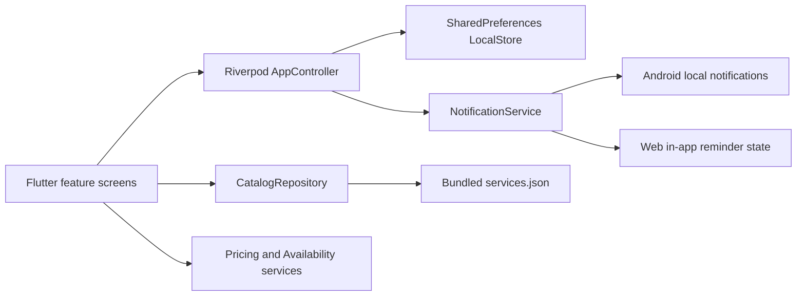
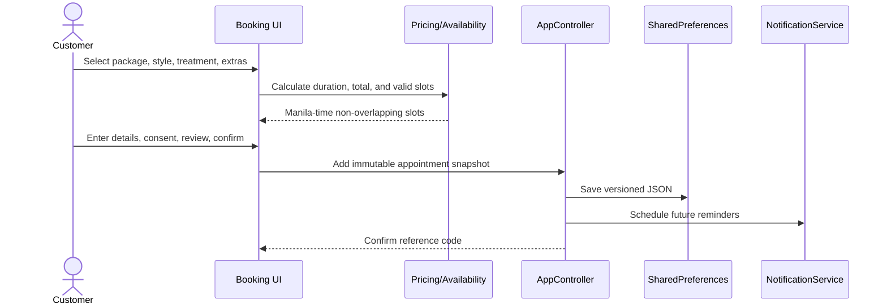

# Architecture and Data Flow

## Structure

The application uses feature-first presentation modules backed by testable core services. Riverpod injects persistence, clock/availability logic, catalog loading, and notifications. GoRouter owns detail and booking routes while the responsive shell owns the four primary destinations.

## Booking flow

## Core models

- `ServicePackage`: static package identity, bilingual descriptions, price, duration, and treatment choices.
- `PaidExtra`: optional item with price and added duration.
- `CustomerProfile`: reusable name, normalized Philippine mobile, and optional email.
- `Appointment`: immutable service snapshot, selections, UTC instants, customer, total, reference, and explicit confirmed/cancelled state.
- `AppState`: onboarding, locale, profile, consent, appointment collection, and recovery notice.

## Persistence

SharedPreferences uses separate versioned keys for profile, appointments, locale, consent, and onboarding. A malformed profile or appointment payload is removed independently so unaffected local data and the bundled catalog remain available. Appointment service snapshots preserve historical names, prices, and durations if static catalog content changes later.

## Time and status

Instants are stored in UTC and converted through the `Asia/Manila` timezone for slot generation and display. Business days begin at 1:00 PM and close at 1:00 AM the next calendar day. Confirmed records with future end times are upcoming; confirmed records whose end has passed are completed; cancelled state remains explicit.

## Production migration

Replace repository and notification implementations with authenticated remote services while retaining models, presentation features, and business-service contracts. A production backend must become the authority for capacity, confirmation, payment, and synchronization.
